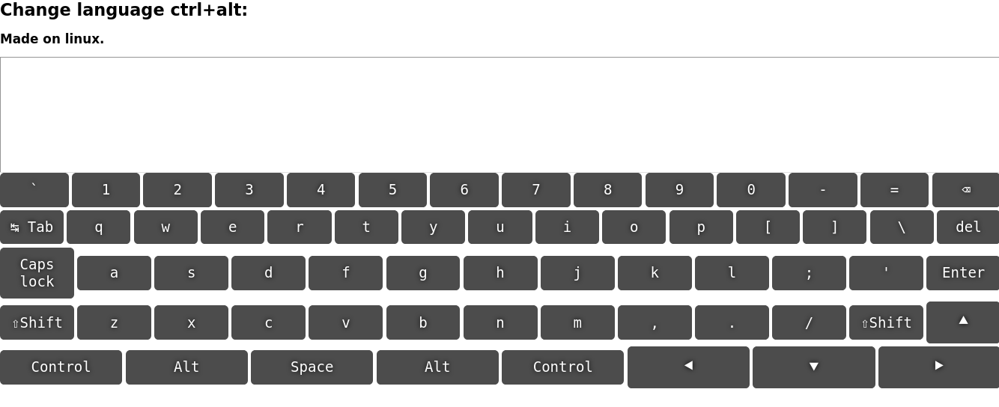

1. Task:

   https://github.com/rolling-scopes-school/tasks/blob/master/tasks/virtual-keyboard/virtual-keyboard-en.md

2. App screenshot: Markup : 

3. Deploy:

   https://salazarsdf.github.io/dist/

4. Done 09.05.2022 (deadline 10.05.2022)

5. Score: 110 / 110

6. Score: 200 / 200

- [x] Minimal scope
  - [x] Feature 1 is implemented (+10)
  - [x] Feature 2 is implemented (+10)
- [x] Basic scope
  - [x] Feature 3 is implemented (+10)
  - [x] Feature 4 is implemented (+10)
- [x] Extra scope
  - [x] Feature 5 is implemented (+10)
  - [x] Feature 6 is implemented (+10)
- [x] Technical requirements
  - [x] ESLint is used (+10)
  - [x] ES6 features are used (+10)
  - [x] Requirements to the repository, commits and pull request are met (+10)
- [x] Penalties
  - [x] Errors while app's working. (-10 for each, but no more than the total number of points for requirement implementation)
  - [x] Not comply with the requirements for Pull Request, repository, commits names (-10) scores by mentor
